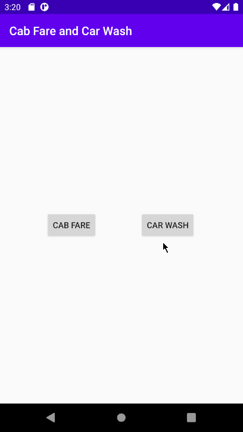
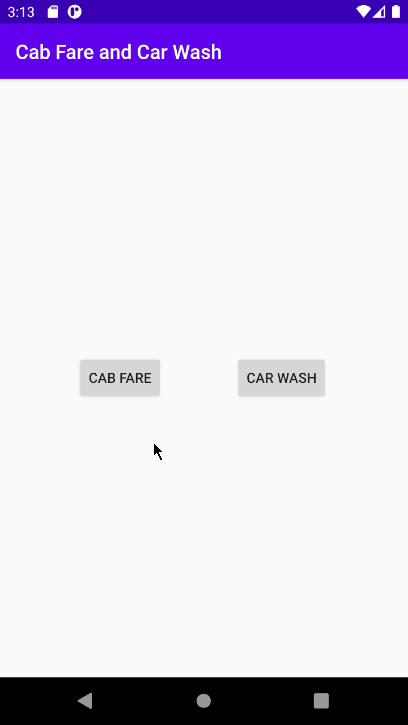

<h1>This is an Android application built with Android Studio, written in Java. It takes user input, performs an operation on it, and returns a modified value.</h1>
<h2>(Unfortunately, Github made me .zip it.)</h2>

This is a gif that displays the functionality of the "Car Wash" class of the application.  
The carwash selection consists of two radio buttons, two different package types, and a discount condition that is met when over 10 washes are bought. 

  

This is a gif that displays the functionality of the "Cab Fare" class of the application.  
The cab fare section is more self explanatory, the base rate plus the multiplier times the miles travelled is returned, based on the type of vehicle chosen. 

